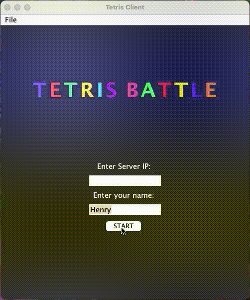
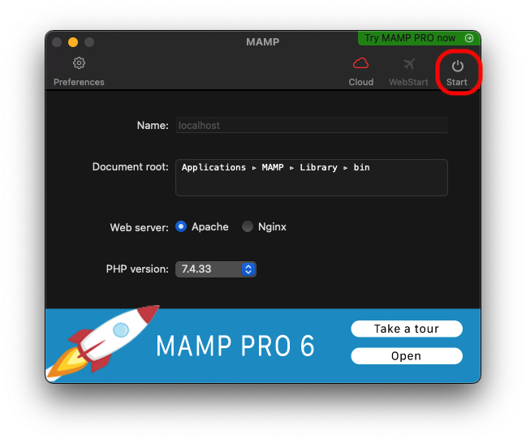
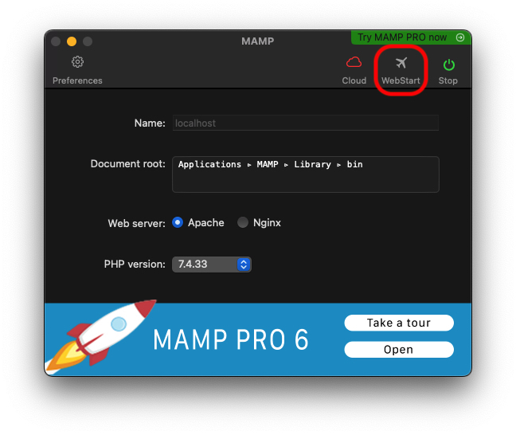
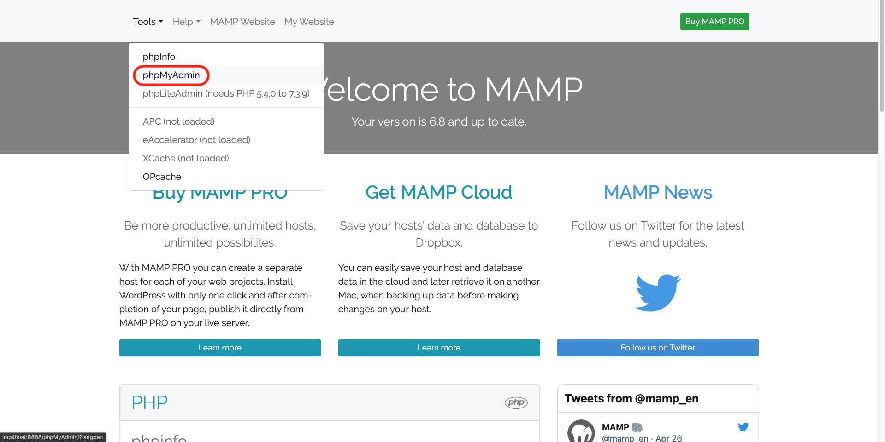
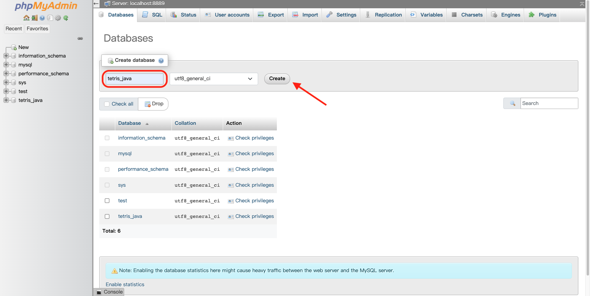
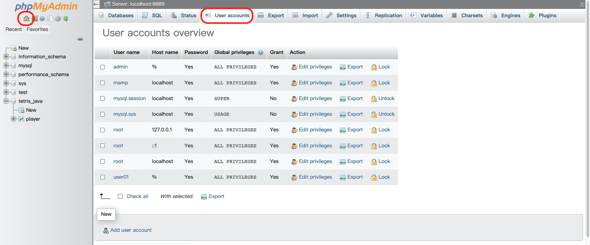
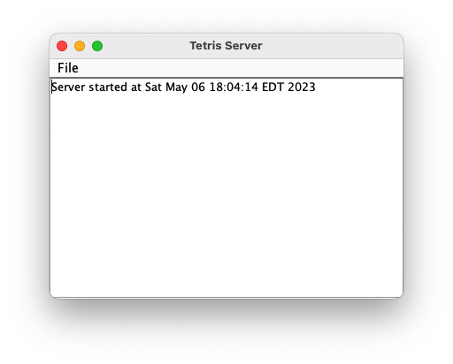
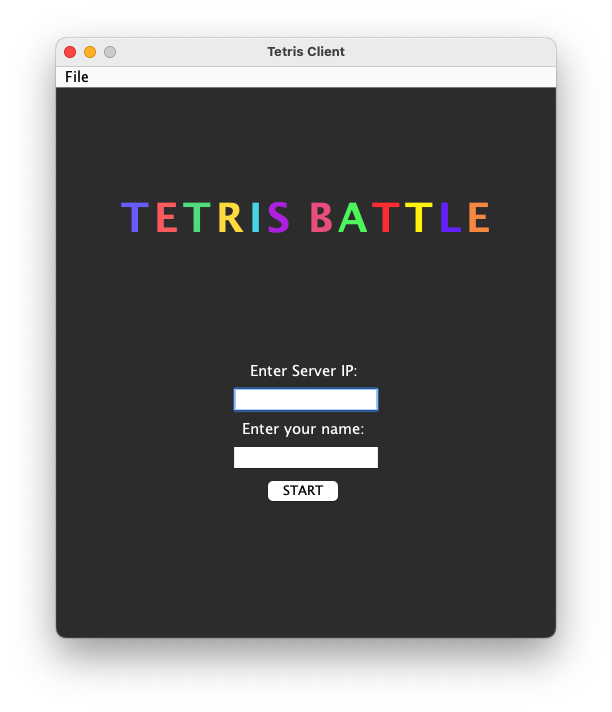
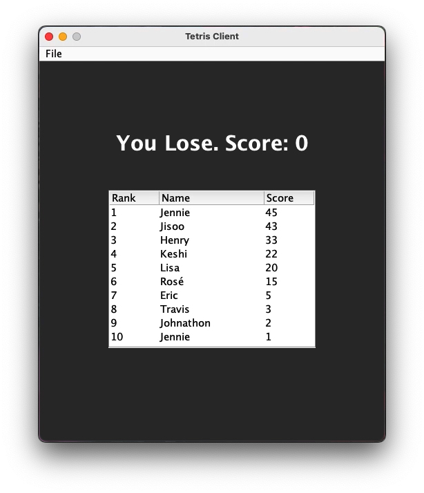

# Java Tetris Battle (multiple players)


## Contents

- <a href="#about-the-project">About The Project</a>
- <a href="#database-setup">Database Setup</a>
- <a href="#how-to-play">How to play</a>

## About The Project

This is a Tetris game that allows two players to battle each other. This program uses client-server architecture. The server uses multithreading to handle multiple players simultaneously. Additionally, the program utilizes a MySQL database to store previous players' scores. After the game, players can view their scores, names, and rank.

<p align="center">

</p>


## Database Setup

To run this game, we need to create a MySQL database to store the score and name. We recommend using [MAMP](https://www.mamp.info/en/windows/) to create a local database.

<br></br>
First of all, download the [MAMP](https://www.mamp.info/en/windows/). After downloading MAMP, open it and click on the "Start" button in the upper right corner to begin.

<p align="center">

</p>

<br></br>
After a few seconds, the start icon will turn green. Click on "WebStart" to proceed.

<p align="center">

</p>

<br></br>
It will bring us to this page, click on "Tools" in the upper left corner, and then click on "phpMyAdmin".

<p align="center">

</p>

<br></br>
To create a database in phpMyAdmin, follow these steps:

1. Click on "Databases" in the top menu.
2. Type the name of the database you want to create (in this example, we'll use "tetris_java").
3. Click "Create".

<p align="center">

</p>

<br></br>
To create a table in the database you just created, follow these steps:

1. Click on the database you just created, then click "New".
2. Type in the name of the table (we will use "player") and create the table as shown below.
3. To add a column, simply click "Go" and a new column will be added.
4. Once you have finished, click "Save".

<p align="center">

</p>

<br></br>
To create an account to access the database, follow these steps:

1. Click the home icon in the top left corner.
2. Click "User accounts" in the menu bar.
3. Click "Add user account" at the bottom.
4. Create an account with the ID "user01" and the password "user01".

<p align="center">

</p>

<br></br>
Remember to check the port number for the database and include it in your code. You can find the place to type it in the TetrisServer file on Line 58.

```java
con = DriverManager.getConnection("jdbc:mysql://localhost:8889/tetris_java","user01","user01");
```

## How to play

To play this game, you need to run one TetrisServer on the computer that is running MAMP, as well as at least two TetrisClients.

If you run all the TetrisServer and TetrisClient on the same computer, you don’t need to type anything in the Server IP textbox on the TetrisClient. It will automatically use 127.0.0.1 (localhost) as the IP.

If you run the TetrisServer and TetrisClient on the different computer, you need to make sure all the computers are linked to the same subnet network, and find the IP of the computer running the TetrisServer. Then, type this IP in both server IP textboxes on TetrisClient to connect them to the TetrisServer.

After that, just type in the player’s name and click start. The game will begin when the server matches two players. When the game start, TetrisServer can monitor all the moves made by players. You can use the following keys to play the game:

- ↑ - rotate (clockwise)
- ↓ - rotate (counterclockwise)
- ← - move left
- → - move right
- P - pause the game
- D - drop down one line
- Space - drop down to the bottom

<p align="center">

</p>


<p align="center">

</p>

<br></br>
After both players have finished, the game result and score rankings (top 10) will be displayed.

<p align="center">

</p>

<p align="right">(<a href="#contents">back to top</a>)</p>
